# 🎫 EventZone 

Una piattaforma moderna e intuitiva per la gestione, creazione e prenotazione di biglietti per vari tipi di eventi (concerti, festival, spettacoli teatrali, cinema). Il progetto offre un'esperienza utente fluida grazie al filtraggio dinamico bilanciato tra lato client e serve, e ad una gestione dello stato centralizzata.

---

## 📸 Preview dell'Applicazione (Web & Mobile)

| Versione Web | Versione Mobile |
| :---: | :---: |
| **Login / Registrazione**<br>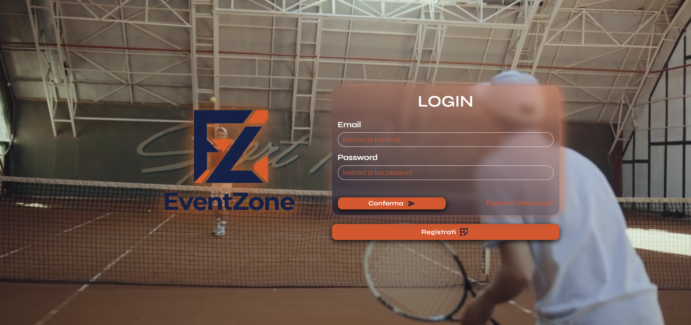 | **Login / Registrazione**<br>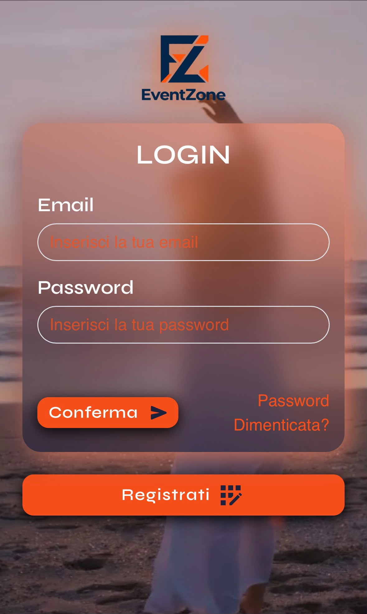 

| Versione Web | Versione Mobile |
| :---: | :---: |
| **Homepage -> Mappa Interattiva**<br>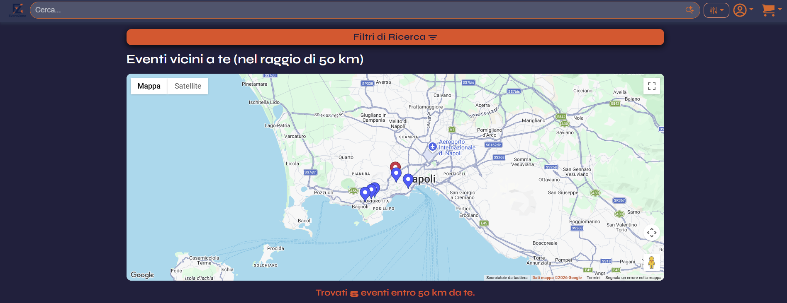 | **Homepage -> Mappa Interattiva**<br>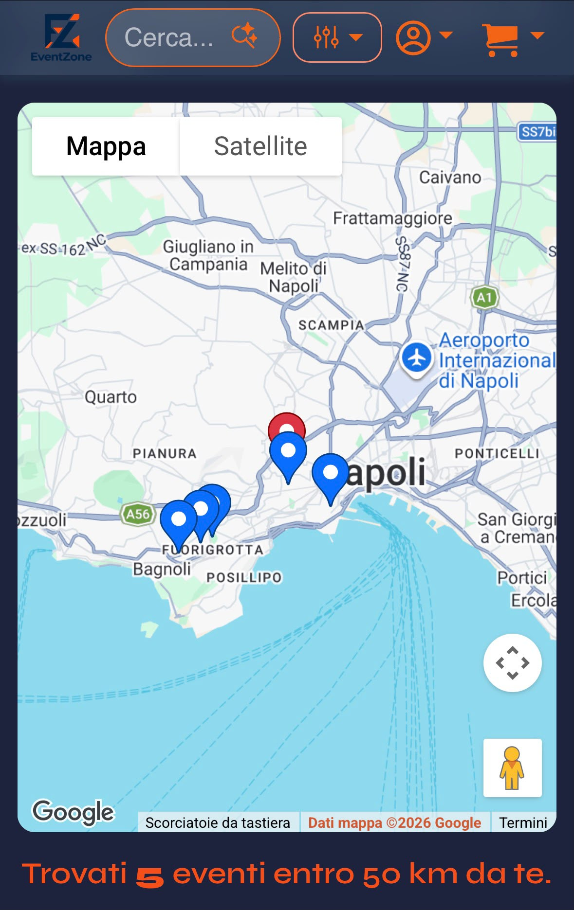 

| Versione Web | Versione Mobile |
| :---: | :---: |
| **Homepage -> Lista Eventi**<br>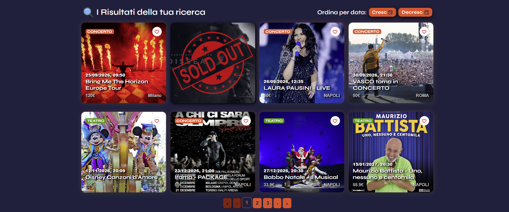 | **Homepage -> Lista Eventi**<br>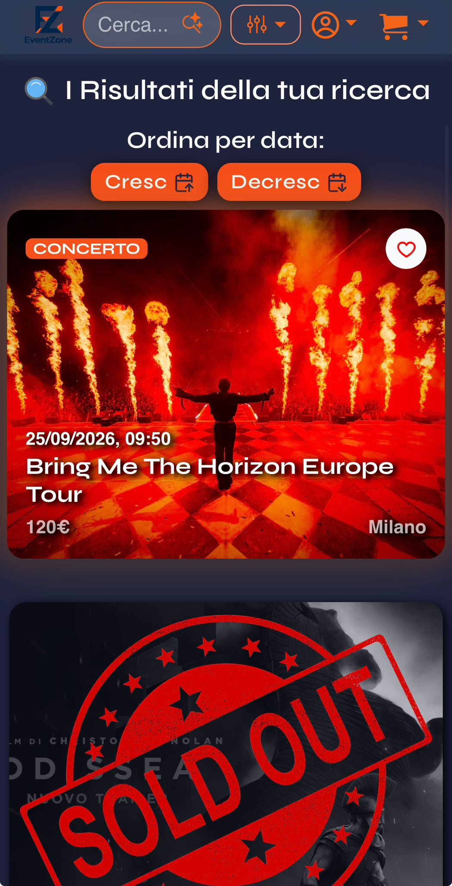 

| Versione Web | Versione Mobile |
| :---: | :---: |
| **Homepage -> Filtri**<br>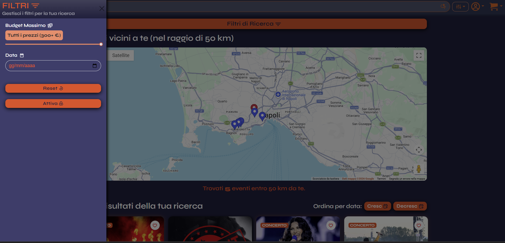 | **Homepage -> Filtri**<br>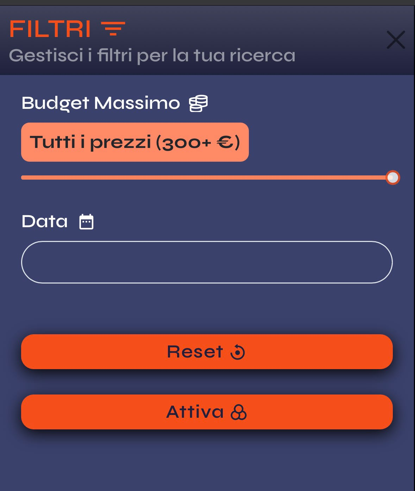 

| Versione Web | Versione Mobile |
| :---: | :---: |
| **Dettagli Evento**<br>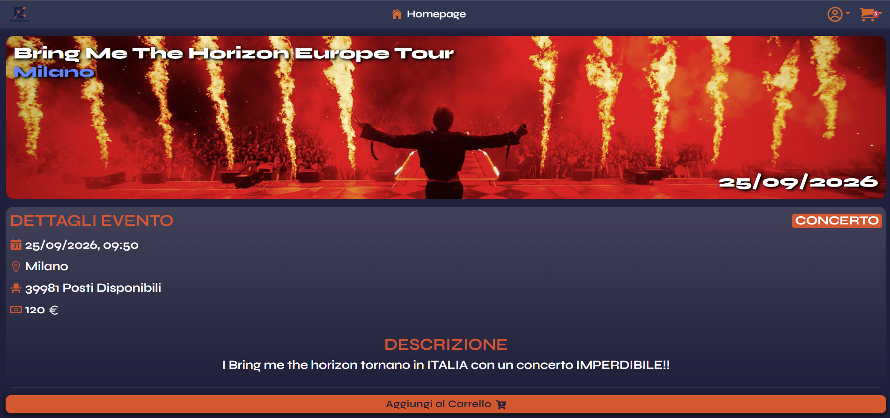 | **Dettagli Evento**<br>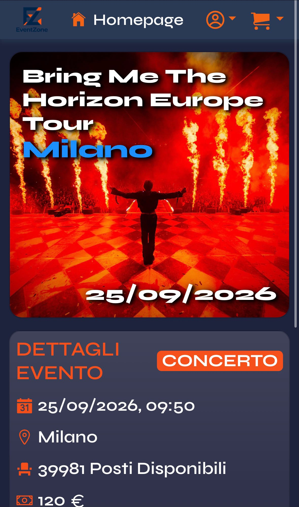 

| Versione Web | Versione Mobile |
| :---: | :---: |
| **Checkout**<br>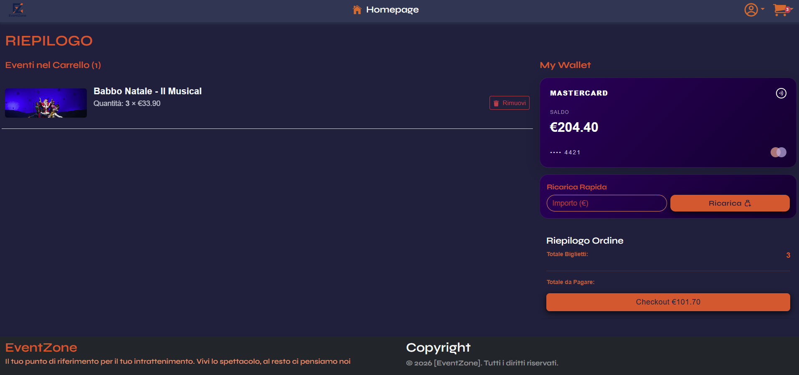 | **Checkout**<br>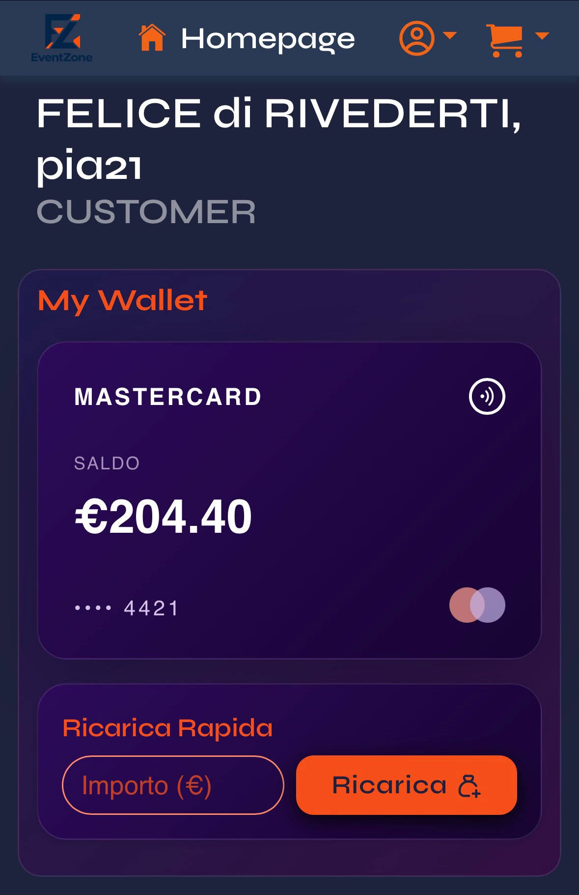 

| Versione Web | Versione Mobile |
| :---: | :---: |
| **Profilo**<br>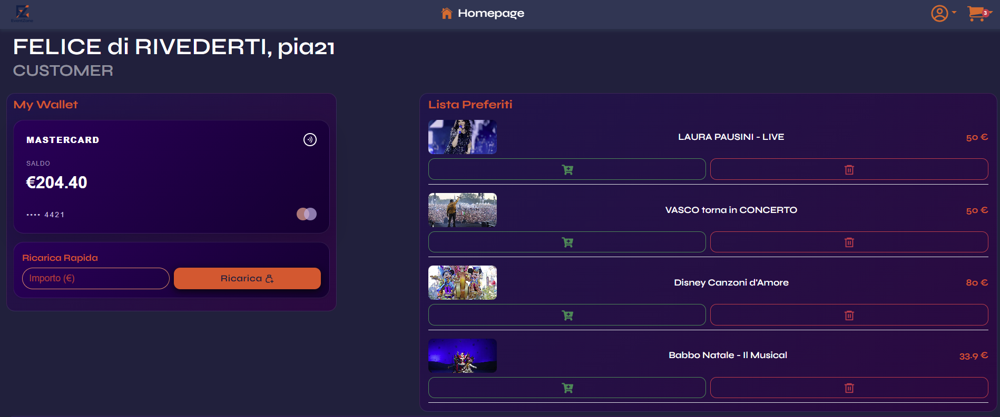 | **Profilo**<br>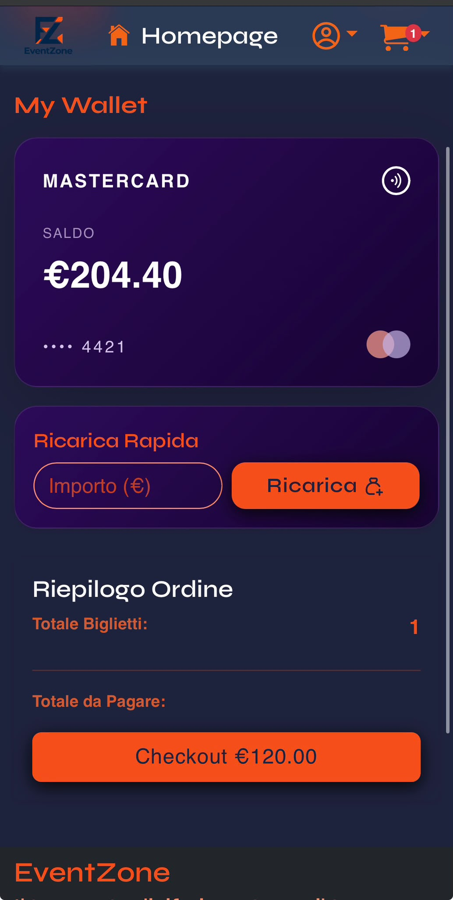 

---

## 🌐 Live Demo & Deployment

L'applicazione è interamente deployata in cloud ed è accessibile online:

**Frontend:** Hosted su **Vercel** ➔ [https://event-zone-lyart.vercel.app]
**Backend:** Hosted su **Railway** ➔ [eventzone-production-4331.up.railway.app]
**Database:** **PostgreSQL** gestito tramite Supabase

### ⚙️ Configurazione Infrastructure & Note Tecniche:
**CORS & Security:** Configurazione Spring Security estesa per supportare richieste cross-origin sicure con `multipart/form-data` per l'upload media.

---

## 🚀 Caratteristiche Principali

- 🔍 **Ricerca e Filtraggio in Tempo Reale:** 
  - Ricerca testuale immediata per titolo dell'evento o luogo.
  - Filtro dinamico per categoria (*Concerti, Festival, Teatro, Cinema*).
  - Filtro avanzato tramite side-bar per **budget massimo** e **data dell'evento**.
- 🛒 **Gestione Carrello:** Aggiunta/rimozione prodotti, calcolo dinamico del totale e conteggio articoli direttamente dalla Navbar.
- ❤️ **Lista Preferiti:** Possibilità di salvare gli eventi preferiti con persistenza dei dati nel `localStorage`.
- 🎨 **Interfaccia Dinamica e Responsive:** Layout fluido adattabile a qualsiasi dispositivo (Desktop, Tablet, Mobile) realizzato con React-Bootstrap e animazioni `framer-motion`.
- ⚡ **Gestione Stato Centralizzata:** Utilizzo di **Redux Toolkit** per coordinare gli stati di eventi, filtri, carrello e utente in modo pulito e scalabile.

---

## 🛠️ Tech Stack

**Frontend:**
- **Core:** React.js, JavaScript (ES6+)
- **State Management:** Redux Toolkit
- **UI & Styling:** React-Bootstrap, Bootstrap 5, CSS3, `rc-slider`
- **Routing:** React Router DOM
- **Icons & Animations:** React Icons, Framer Motion

**Backend**
- **Core Framework:** Spring Boot (Java)
- **Architettura:** RESTful API con pattern Controller-Service-Repository
- **Autenticazione & Sicurezza:** Spring Security, JWT (JSON Web Token) per l'autorizzazione basata su ruoli (CUSTOMER / ADMIN / ORGANIZER)
- **Persistenza Dati:** Spring Data JPA / Hibernate
- **Database:** PostgreSQL
- **Validazione:** Jakarta Bean Validation 

---

### 📂 Struttura delle cartelle

#### **Frontend (`src/`)**
```text
src/
├── assets/          # Immagini, loghi e stili CSS
├── components/      # Componenti UI riutilizzabili (Navbar, LoadingCard, EventCard...)
├── helpers/         # Funzioni utility pure (formatters, costanti, badgeColor...)
├── pages/           # Pagine principali/rotte (Home, EventDetails, Checkout, Profile...)
├── redux/           # Gestione dello stato globale
│   ├── slices/      # eventSlice.js, cartSlice.js, userSlice.js
│   └── store.js     # Configurazione principale dello Store Redux
├── services/        # Client Axios e chiamate al backend (eventService.js, api.js)
├── App.jsx          # Componente principale e gestione delle rotte
└── main.jsx         # Entry point dell'applicazione React
```

#### **Backend (`src/main/java/...`)**
```text

├── configurations/      # Configurazioni generali (App Config, Swagger, CORS)
├── controllers/         # Endpoints REST (gestione delle richieste HTTP)
├── entities/            # Entità JPA / Tabelle del Database (Event, User, Ticket, ecc.)
├── enums/               # Enumerazioni di sistema (es. Role, EventType, Status)
├── exceptions/          # Gestione centralizzata delle eccezioni custom (@ControllerAdvice)
├── payloads/            # DTOs, Request e Response Payloads per lo scambio dati
├── repositories/        # Interfacce Spring Data JPA per l'accesso ai dati
├── security/            # Autenticazione JWT, filtri di protezione e UserDetailsService
├── services/            # Business Logic dell'applicazione
└── EventZoneApplication.java # Entry point dell'applicazione Spring Boot
```
